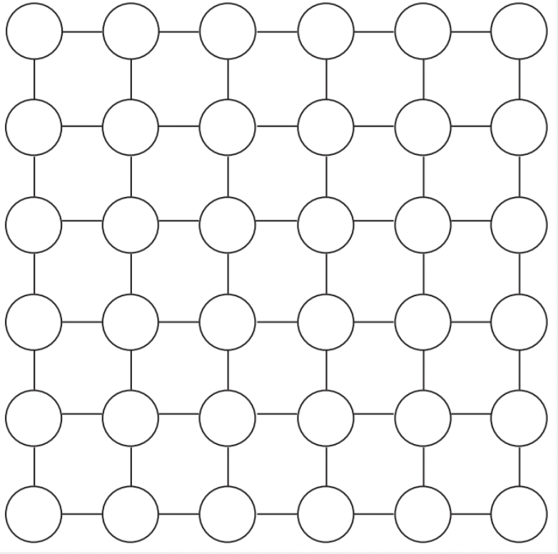

# Aproximaciones
{:.no_toc}

## Contenidos
{:.no_toc}

1. TOC
{:toc}

## Ejercicio resuelto

### Solución

## Ejercicios propuestos

1.  (★★) Dado un grafo en forma de grilla como el dado a continuación (y también a los del ejercicio 2), donde
    cada vértice tiene un peso $$w(v)$$, se desea maximizar la sumatoria
    de los pesos de un Independent Set sobre dicho grafo. 

    a. Dar un algoritmo greedy que sirva de **aproximación** para la solución al problema. 

    b. Demostrar que cualquier vértice es parte de la solución aproximada, o bien tiene
    peso menor (o igual) a alguno de sus adyacentes, que es en efecto parte de dicha solución. 

    c. Analizar qué tan buena es la aproximación.

    d. Analizar qué tan buena es la aproximación en el caso de un grafo que no necesariamente tenga esta forma de grilla. 

    {:width="50%"}

1.  (★★★) El _2-Partition Problem_ como problema de optimización se describe tal que: 
    Dado un conjunto de $$n$$ números positivos $$T= \lbrace T_1, T_2, \dots, T_n \rbrace$$, 
    se particionan los números en dos subconjuntos $$S_1$$ y $$S_2$$ (con intersección vacía y 
    unión = T) de forma de minimizar la sumatoria de cualquiera de los subconjuntos 
    ($$\min \max (S_1, S_2)$$).
    
    Para este problema, podemos plantear el siguiente algoritmo aproximado:
    Inicializar la solución como dos subconjuntos vacíos recorriendo los elementos de $$T$$,
    para cada elemento se lo coloca en el subconjunto con menor sumatoria hasta el momento. 

    Demostrar que el algoritmo propuesto es una $$\frac{3}{2}$$-Aproximación.

1.  (★★★) Un centro de fotocopiado tiene un conjunto de máquinas para procesar diferentes trabajos. 
    Las mismas las compró en dos momentos diferentes. Teniendo $$m$$ fotocopiadoras de la primera 
    compra y $$k$$ fotocopiadoras más modernas de la segunda. Como la tecnología mejoró las más 
    nuevas trabajan el doble de rápido que las viejas. Cada día recibe un conjunto de pedidos con 
    diferentes longitudes. Desea asignar las tareas a las máquinas de tal forma de terminar lo antes 
    posible la jornada de trabajo.

    Proponer un algoritmo de aproximación de tal forma que la diferencia con el óptimo sea como mucho 
    3 veces mayor.

1.  (★★) Dado un grafo bipartito (no dirigido) donde cada vértice $v$ tiene un valor positivo $w(v)$ asociado, 
    queremos obtener un Vertex Cover de suma mínima. Este problema es NP-Difícil, por lo que aplicaremos el 
    siguiente **algoritmo de aproximación**: 

    1. Inicializaremos $resultado = \emptyset$ como un conjunto vacío. 
    2. Vemos todas las aristas del grafo (sin ningún orden particular). Si la arista está cubierta, 
    es decir, algún vértice de sus extremos está en el conjunto resultado, 
    la ignoramos. Sino, agregamos a $resultado$ al vértice del extremo de la arista cuyo valor sea menor
    (si son iguales, cualquiera de los dos).
    3. Devolvemos $resultado$.

    ¿Podemos considerarla una buena aproximación? Calcular la cota de aproximación para justificar tu 
    respuesta. 

1.  (★★★) Recordamos el problema de Interval Scheduling: Dado un conjunto de charlas
    a dar, con un horario de inicio y fin cada una, determinar la máxima cantidad
    de charlas a dar de tal forma que no haya solapamiento de horarios entre ninguna
    de las elegidas (devolver las charlas que logran esto). 

    En clase, analizamos la siguiente solución, que vimos que **no** es óptima: 
    ordenar de menor a mayor **duración**, e ir agregando las tareas en dicho orden
    en tanto y cuanto no se solape con otra ya incluida. 

    Demostrar que este algoritmo es una 2-aproximación (es decir, que la cantidad
    de charlas que incluye es al menos la mitad de la solución óptima).
