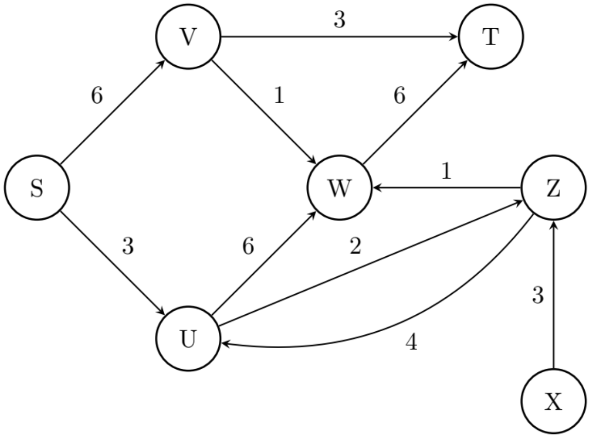
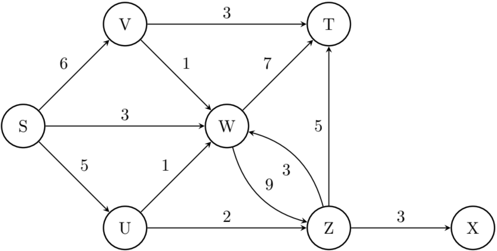

# Redes de Transporte
{:.no_toc}

## Contenidos
{:.no_toc}

1. TOC
{:toc}

## Ejercicio resuelto

### Solución

#### Demostración del orden

## Ejercicios propuestos

1.  (★) Explicar para cada uno de los siguientes casos, qué modificaciones se deben aplicar sobre una red para convertirla en 
    una red de flujo apta para la utilización del algoritmo de Ford-Fulkerson.

    a. En la red existen bucles. 

    b. En la red hay ciclos de dos vértices (aristas antiparalelas). 

    c. En la red hay más de una fuente. 

    d. En la red hay más de un sumidero. 

1.  (★★) Implementar el algoritmo de Ford-Fulkerson, asumiendo que ya está implementada una función `actualizar_grafo_residual`, 
    definida como `actualizar_grafo_residual(grafo_residual, u, v, valor)`, que recibe el _grafo residual_, una arista dirigida dada 
    por los _vértices u y v_, y el nuevo _valor_ del flujo a través de la arista `(u,v)` y actualiza el grafo residual ya teniendo en 
    cuenta el peso anterior de la arista, y su antiparalela. Devolver un diccionario con los valores de los flujos para todas las 
    aristas del grafo original.

1.  (★★) Dada una red y un diccionario que representa los valores de los flujos para las aristas, todos valores que respetan la 
    restricción de cada arista, construir la red residual que refleja el estado actual de la red en función a los valores de flujo dados.

1.  (★) Dada una red residual, dar un algoritmo que encuentre un camino de aumento que minimice el número de aristas utilizadas.

1.  (★★) Dado un flujo máximo de un grafo, implementar un algoritmo que, si se le aumenta en una unidad la capacidad a una 
    artista (por ejemplo, a una arista de capacidad 3 se le aumenta a 4, permita obtener el nuevo flujo máximo en tiempo lineal 
    en vértices y aristas. Indicar y justificar la complejidad del algoritmo implementado.

1.  (★★) Hacer un seguimiento de obtener el flujo máximo en la siguiente red de transporte, realizando las modificaciones previas 
    que fueran necesarias. Luego, definir cuáles son los dos conjuntos del corte mínimo en dicha red.

    {:width="50%"}

1.  (★★) Hacer un seguimiento de obtener el flujo máximo en la siguiente red de transporte, realizando las modificaciones previas 
    que fueran necesarias. Luego, definir cuáles son los dos conjuntos del corte mínimo en dicha red.

    {:width="60%"}

1.  (★) ¿Cuál es la relación entre el flujo máximo de una red, y un corte mínimo que separe su fuente y sumidero?

1.  (★★) Dado un grafo no dirigido, un match es un subconjunto de las aristas en el cual para todo vértice $$v$$ a lo sumo una arista 
    del match incide en $$v$$ (en el match, tienen grado a lo sumo 1). Decimos que el vértice $$v$$ está matcheado si hay alguna arista que 
    incida en él (sino, está unmatcheado). El matching máximo es aquel en el que tenemos la mayor cantidad de aristas (matcheamos la 
    mayor cantidad posible). Dar una metodología para encontrar el matching máximo de un grafo, explicando en detalle cómo se modela 
    el problema, cómo se lo resuelve y cómo se consigue el matching máximo. ¿Cuál es el orden temporal de la solución implementada?

1.  (★★) Decimos que dos caminos son disjuntos si no comparten aristas (pueden compartir nodos). Dado un grafo dirigido y dos vértices 
    $$s$$ y $$t$$, encontrar el máximo número de caminos disjuntos `s-t` en G. Dar una metodología, explicando en detalle cómo se modela el problema, 
    cómo se lo resuelve y cómo se consigue el máximo número de caminos disjuntos. ¿Cuál es el orden temporal de la solución implementada?

1.  (★★★) Supongamos que tenemos un sistema de una facultad en el que cada alumno puede pedir hasta 10 libros de la biblioteca. La biblioteca 
    tiene 3 copias de cada libro. Cada alumno desea pedir libros diferentes. Implementar un algoritmo que nos permita obtener la forma de 
    asignar libros a alumnos de tal forma que la cantidad de préstamos sea máxima. Dar la metodología, explicando en detalle cómo se modela 
    el problema, cómo se lo resuelve y cómo se consigue la máxima cantidad de prestamos. ¿Cuál es el orden temporal de la solución implementada?

1.  (★★★) Suponer que queremos schedulear cómo los aviones van de un aeropuerto a otro para cumplir sus horarios. Podemos decir que podemos 
    usar un avión para un segmento/vuelo $$i$$ y luego para otro $$j$$ si se cumple alguna de las siguientes condiciones: 
    a. El destino de $$i$$ y el origen de $$j$$ son el mismo. o
    b. Podemos agregar un vuelo desde el destino de $$i$$ al origen de $$j$$ con tiempo suficiente. 

    Decimos que el vuelo $$j$$ es alcanzable desde el vuelo $$i$$ si es posible usar el avión del vuelo $$i$$ y después para el vuelo $$j$$.  
    Dados todos los vuelos con origen y destino, y el tiempo que tarda un avión entre cada par de ciudades queremos decidir: ¿Podemos 
    cumplir con los m vuelos usando a lo sumo $$k$$ aviones? Dar la metodología, explicando en detalle cómo se modela el problema, 
    cómo se lo resuelve y cómo se decide si es posible cumplir con la premisa. ¿Cuál es el orden temporal de la solución implementada?

1.  (★★★) Carlos tiene un problema: sus 5 hijos no se soportan. Esto es a tal punto, que ni siquiera están dispuestos a caminar 
    juntos para ir a la escuela. Incluso más: ¡tampoco quieren pasar por una cuadra por la que haya pasado alguno de sus 
    hermanos! Sólo aceptan pasar por las esquinas, si es que algún otro pasó por allí. Por suerte, tanto la casa como la 
    escuela quedan en esquinas, pero no está seguro si es posible enviar a sus 5 hijos a la misma escuela. No se puede asumir que
    la ciudad tenga alguna forma en específico, por ejemplo, no hay que asumir que todas las calles sean cuadradas. Utilizando lo 
    visto en la materia, formular este problema y resolverlo. Indicar y justificar la complejidad del algoritmo.

1.  (★★★) Se está formando una nueva comisión de actividades culturales de un pueblo. Cada habitante es miembro de 0 o más 
    clubes, y de exactamente 1 partido político. Cada grupo de interés debe nombrar a un representante ante la nueva 
    comisión de actividades culturales, con las siguientes restricciones: cada partido político no puede tener más de $$n/2$$ 
    simpatizantes en la comisión, cada persona puede representar a solo un club, cada club debe estar representado por 
    un miembro. Implementar un algoritmo que dada la información de los habitantes (a qué clubes son miembros, a 
    qué partido pertenecen), nos dé una lista de representantes válidos. Indicar y justificar la complejidad del algoritmo 
    implementado.

1.  (★★★) En un hospital, se tiene un conjunto de médicos y un conjunto de pacientes. Cada médico tiene un horario con franjas 
    horarias disponibles para citas médicas y su área de especialidad, y cada paciente tiene sus franjas horaria disponibles para 
    ir al médico, junto con la información de qué tipo de especialidad requiere. Nuestro objetivo es emparejar médicos con pacientes 
    de manera que se maximice el número total de citas médicas programadas. Se puede asumir que cada visita médica dura una cuota de 
    tiempo fija, y que los pacientes pueden ser a priori atendidos por cualquier médico que coincida con el área de especialidad que 
    requieren. Implementar un algoritmo que resuelva dicho problema de manera eficiente. Indicar y justificar la complejidad del 
    algoritmo implementado.

1.  (★★★) Una red de satélites se construyó para permitir la comunicación entre una nave espacial y la tierra. Ciertos
    Satélites pueden intercambiar mensajes entre otros (ida y vuelta). Algunos con la tierra, otros con la nave espacial. 
    Contamos con la red y se pide medir su robustez: ¿cuántos satélites (en el peor de los casos) se pueden romper que
    dejen incomunicada la nave con la tierra? ¿Cuáles? Utilizando redes de flujo, resolver el problema. Indicar y
    justificar la complejidad del algoritmo implementado. Recordar que esto último debe estar en las variables del
    problema. 

{::options toc_levels="2" /}
