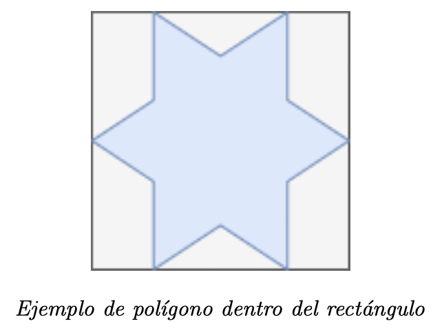

# Algoritmos Randomizados
{:.no_toc}

## Contenidos
{:.no_toc}

1. TOC
{:toc}

## Ejercicio resuelto

### Solución

## Ejercicios propuestos

1.  (★★) Realizar un seguimiento al operar con una Skip List (inicialmente vacía) 
    para agregar los siguientes elementos: `8, 12, 20, 15, 5, 2, 9, 14`.
    Cuando se necesiten resultados aleatorios, se puede utilizar la siguiente 
    secuencia: `0 1 1 0 0 1 0 1 1 0 0 0 0 1 0 1 1 1 1 0 0 0 0 0 1 1 0 0 1 0 1 1 0`.
    Luego mostrar un seguimiento de las búsquedas de: 18, 9 y 2.

1.  (★★) Explicar detalladamente por qué elegimos un pivote de forma aleatoria para Quicksort. 
    ¿Cuál es la complejidad esperada para el algoritmo? Justificar (no es necesario entrar en
    demostraciones utilizando probabilidad y estadística, pero esperamos una noción)
    Sin saber nada de las posiciones que QuickSort va a elegir como pivote, ¿Cómo podría forzar 
    el usuario que el algoritmo demore más tiempo que el esperado?

1.  (★★★) Se tiene una función `monedaCargada` que devuelve 0 el 60% de las veces, y 1 el 40% de las veces.
    Implementar una función que utilice la antes mencionada, que devuelva 0 o 1 de forma aleatoria de
    forma equiprobable (es decir, con probabilidad 50/50). ¿Cuál es la complejidad esperada para el algoritmo?
    Justificar. 

    

        
Quiero una pista

  
            Si ejecuto dos veces la función `monedaCargada`, ¿cuál es la probabilidad de que primero
            salga un 0 y luego un 1? ¿y la de que primero salga 1 y luego un 0?
  
    

1.  (★★★) Dado un Grafo, planteamos el siguiente algoritmo de aproximación randomizado para obtener el Independent
    Set más grande, para el caso de un grafo $$d$$-regular (es decir, un grafo en el cual todos los vértices
    tienen grado exactamente $$d$$):
    Para cada vértice $$v$$ seleccionar de forma uniformemente aleatoria $$x_v$$ el valor 0 o 1.
    Seleccionar para el Independent Set únicamente aquellos vértices con el valor 1 
    que no se conecten mediante aristas con otros vértices que tengan el valor 1.

    a. Probar que el set resultante es independiente.
    b. Calcula el tamaño esperado del set independiente (en función de $$n$$ y $$d$$)
    c. Para el cálculo de $$x_v$$ utilizamos $$p = \frac{1}{2}$$. Determinar si este es el valor mas conveniente 
    o podemos encontrar uno mejor. Si es asi, de la fórmula del valor esperado con esta nueva probabilidad.

1.  (★★★) Se tiene un polígono irregular que sabemos que encaja en un rectángulo de bas `B` y altura `H`.
    Asumir que se cuenta con una función `dentro_del_poligono(punto)`, que retorna `True` si el punto 
    dado por parámetro esta dentro del polígono, `False` en caso contrario. Proponer un algoritmo 
    randomizado con el que se pueda estimar el área de esta figura irregular.

    

